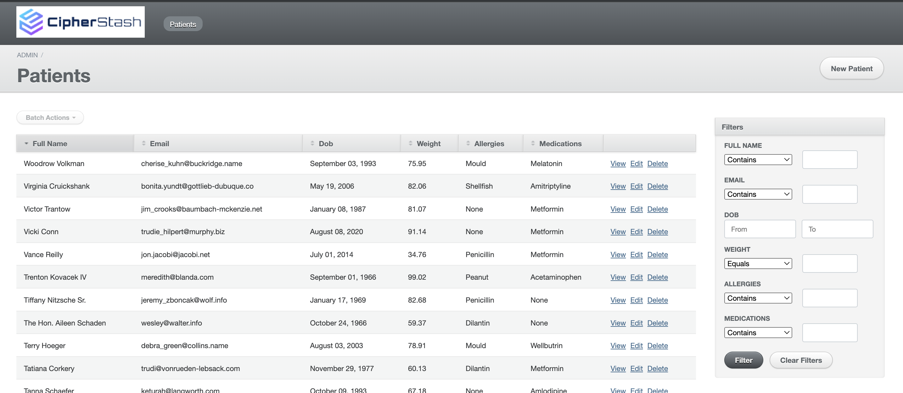
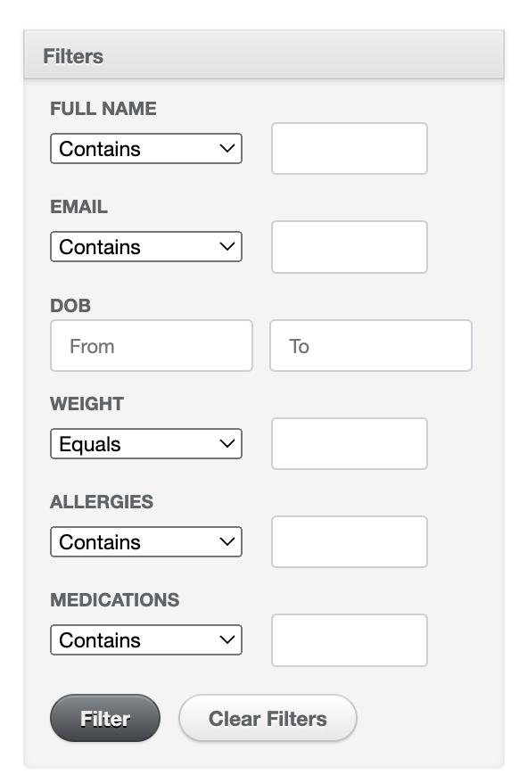

# CipherStash Rails App Demo

This repo contains a Rails app which can be used to demonstrate how to configure CipherStash Protect for a Rails app.

The demo app is an admin view of generated fake medical data for patients.

To view the the Demo app with the completed code checkout the branch `completed-demo-app`.

## Running the Demo

### Prerequisites

- Ruby >= 3.1.3
- Rails 7: Follow the rails [getting started guide](https://guides.rubyonrails.org/v5.1/getting_started.html) for installing Ruby and Rails.
- [PostgreSQL](https://www.postgresql.org/download/)
- [direnv](https://direnv.net/docs/installation.html)

### Get started

1. Install dependencies:

```bash
bundle install
```

2. Create db, run migrations and seed db with dummy patient data:

```bash
rails db:setup
```

3. Run rails server:

```bash
rails s
```

4. Go to the [patients dashboard](http://localhost:3000/admin/patients).

We now have a running Rails application to use to learn how to configure CipherStash to encrypt data.

### Install the CipherStash CLI

The CipherStash CLI is used to manage your account (e.g login) and encryption schema.

The encryption schema defines what encrypted indexes exist, and what queries you can perform on those indexes.

Download the binary for your platform:

- [Linux ARM64](https://github.com/cipherstash/cli-releases/releases/latest/download/stash-aarch64-unknown-linux-gnu)
- [Linux ARM64 musl](https://github.com/cipherstash/cli-releases/releases/latest/download/stash-aarch64-unknown-linux-musl)
- [Linux x86_64](https://github.com/cipherstash/cli-releases/releases/latest/download/stash-x86_64-unknown-linux-gnu)
- [Linux x86_64 musl](https://github.com/cipherstash/cli-releases/releases/latest/download/stash-x86_64-unknown-linux-musl)
- [macOS ARM](https://github.com/cipherstash/cli-releases/releases/latest/download/stash-aarch64-apple-darwin)
- [macOS x86_64](https://github.com/cipherstash/cli-releases/releases/latest/download/stash-x86_64-apple-darwin)
- [Windows x86_64 GNU](https://github.com/cipherstash/cli-releases/releases/latest/download/stash-x86_64-pc-windows-gnu.exe)
- [Windows x86_64 MSVC](https://github.com/cipherstash/cli-releases/releases/latest/download/stash-x86_64-pc-windows-msvc.exe)

Place the binary on your `$PATH`, so you can run it.

### Get a CipherStash account and workspace

To use CipherStash you'll need a CipherStash account and workspace.

You can signup from the CLI:

```bash
stash signup
```

>Your browser will open to [https://cipherstash.com/signup/stash](https://cipherstash.com/signup/stash) where you can sign up with either your GitHub account, or a standalone email.

### Install the CipherStash database driver

The CipherStash database driver transparently maps SQL statements to encrypted database columns.

We need to add it to the Rails app, and tell Rails to use it.

Add the `activerecord-cipherstash-pg-adapter` to your Gemfile:

``` ruby
gem "activerecord-cipherstash-pg-adapter"
```

Remove the `pg` gem from your Gemfile.

Run `bundle install`.

And update the default adapter settings in `config/database.yml` with `cipherstash-pg`:

``` yaml
default: &default
  adapter: postgres_cipherstash
```

### Log in

Make sure `stash` is logged in:

``` bash
stash login
```

This will save a special token `stash` will use for talking to CipherStash.

### Create a dataset

Next, we need to create a dataset for tracking what data needs to be encrypted.

A dataset holds configuration for one or more database tables that contain data to be encrypted.

Create our first dataset by running:

```
stash datasets create patients --description "Data about patients"
```

The output will look like this:

```
Dataset created:
ID         : <a UUID style ID>
Name       : patients
Description: Data about patients
```

Note down the dataset ID, as you'll need it in step 3.

### Create a client

Next we need to create a client.

A client allows an application to programatically access a dataset.

A dataset can have many clients (for example, different applications working with the same data), but a client belongs to exactly one dataset.

Use the dataset ID from step 2 to create a client (making sure you substitute your own dataset ID):

```
stash clients create --dataset-id $DATASET_ID "Rails app"
```

The output will look like this:

```
Client created:
Client ID  : <a UUID style ID>
Name       : Rails
Description:
Dataset ID : <your provided dataset ID>

#################################################
#                                               #
#  Copy and store these credentials securely.   #
#                                               #
#  THIS IS THE LAST TIME YOU WILL SEE THE KEY.  #
#                                               #
#################################################

Client ID          : <a UUID style ID>

Client Key [hex]   : <a long hex string>
```

Note down the client key somewhere safe, like a password vault.
You will only ever see this credential once.
This is your personal key, and you should not share it.

Set these as environment variables in the `.envrc` file using the below variable names:

```bash
export CS_CLIENT_KEY=
export CS_CLIENT_ID=
```

Run:

```bash
direnv allow
```

### Push the dataset configuration

Now we need to configure what columns are encrypted, and what indexes we want on those columns.

This configuration is used by the CipherStash driver to transparently rewrite your app's SQL queries to use the underlying encrypted columns.

Our demo rails app has a schema that looks like this:

``` ruby
class CreateUsers < ActiveRecord::Migration[7.1]
  def change
    create_table :users do |t|
      t.string :full_name
      t.string :email
      t.date :dob
      t.float :weight
      t.string :allergies
      t.string :medications

      t.timestamps
    end
  end
end
```

We will want to encrypt all columns, as they contain sensitive information.

We do this with a configuration file which is in the root of the rails demo titled `dataset.yml`:

This configuration file defines two types of encrypted indexes for the columns we want to protect:

- A `match` index on the `full_name`, `email`, `allergies` and `medications` columns, for full text matches
- A `ore` index on the `full_name`, `email`, `dob` and `weight` columns, for sorting and range queries

Now we push this configuration to CipherStash:

```bash
stash upload-config --file dataset.yml --client-id <the client-id from above> --client-key <the client-key from above>
```

### Add and apply migrations

The first migration to run, is the install of the Protect custom types into your database.

This migration adds in the custom types `ore_64_8_v1` and `ore_64_8_v1_term`.

- `ore_64_8_v1` is used for `string` and `text` types.
- `ore_64_8_v1_term` is used for non string types.

We do this by creating a Rails migration:

```
rails generate migration AddProtectDatabaseExtensions
```

And adding the following code:

```ruby
class AddProtectDatabaseExtensions < ActiveRecord::Migration[7.0]
  def up
    ActiveRecord::ConnectionAdapters::CipherStashPG.install
  end

  def down
    ActiveRecord::ConnectionAdapters::CipherStashPG.uninstall
  end
end
```

Apply the migration:

``` bash
rails db:migrate
```

The CipherStash driver works by rewriting your app's SQL queries to use the underlying encrypted columns.

To set up those encrypted columns, generate another Rails migration:

``` bash
rails generate migration AddProtectEncryptedColumnstoPatientsTable
```

And add the following code:

```ruby
class AddProtectEncryptedColumnstoPatientsTable < ActiveRecord::Migration[7.0]
  def change
    add_column :patients, :__full_name_encrypted, :text
    add_column :patients, :__full_name_match, :integer, limit: 2, array: true
    add_column :patients, :__full_name_ore, :ore_64_8_v1
    add_column :patients, :__full_name_unique, :text

    add_column :patients, :__email_encrypted, :text
    add_column :patients, :__email_match, :integer, limit: 2, array: true
    add_column :patients, :__email_ore, :ore_64_8_v1
    add_column :patients, :__email_unique, :text

    add_column :patients, :__dob_encrypted, :text
    add_column :patients, :__dob_ore, :ore_64_8_v1_term

    add_column :patients, :__weight_encrypted, :text
    add_column :patients, :__weight_ore, :ore_64_8_v1_term

    add_column :patients, :__allergies_encrypted, :text
    add_column :patients, :__allergies_match, :integer, limit: 2, array: true
    add_column :patients, :__allergies_ore, :ore_64_8_v1
    add_column :patients, :__allergies_unique, :text

    add_column :patients, :__medications_encrypted, :text
    add_column :patients, :__medications_match, :integer, limit: 2, array: true
    add_column :patients, :__medications_ore, :ore_64_8_v1
    add_column :patients, :__medications_unique, :text

    # Add indexes to the encrypted columns.
    add_index :patients, :__full_name_ore
    add_index :patients, :__email_ore
    add_index :patients, :__dob_ore
    add_index :patients, :__weight_ore
    add_index :patients, :__allergies_ore
    add_index :patients, :__medications_ore

    add_index :patients, :__full_name_match, using: :gin
    add_index :patients, :__email_match, using: :gin
    add_index :patients, :__allergies_match, using: :gin
    add_index :patients, :__medications_match, using: :gin
  end
end
```

The `_encrypted` columns are the encrypted values, and the `_match` and `_ore` columns are the encrypted indexes.

Apply the migration:

``` bash
rails db:migrate
```

### Encrypt the sensitive data

Now we have the necessary database structure in place, it's time to encrypt your data.

Fire up a rails console:

```bash
rails c
```

<!-- TODO: Update docs when we have an encrypt method to call in the active-record adapator gem.  -->
And encrypt your data:

``` ruby
Patient.find_each(:batch_size => 1000) { |p| p.update_columns(p.attributes.filter { |attr| !attr.starts_with?("__") }) }
```

This will pull the unencrypted data, encrypt it, and write it back to the new columns.

### Update your model

Add the below to the Patient model.

```ruby
class Patient < ApplicationRecord
  # This will be removed when Protect GA is released.
  self.ignored_columns = %w[wildcardoperatorfix]
  # This will be removed when Protect GA is released.
  def self.columns
    super.reject {|column| column.name.starts_with?('__')}
  end
end
```

This is a temporary fix to enable Protect to work.

When GA is released these fixes will be removed.

### Test querying records via PSQL

The configuration is currently set to `plaintext-duplicate` mode on each field.

In this mode, the plaintext field's will be read from and written to.

The encrypted field's will be written to.

Update the mode on each field in the `dataset.yml` to `encrypted-duplicate` mode.

In this mode, the plaintext field will be written to.

The encrypted field's will be read from and written to.

Push this configration to CipherStash:

```bash
stash upload-config --file dataset.yml --client-id <the client-id from previous step> --client-key <the client-key from previous step>
```

Open your Rails console:

```bash
rails console
```

Create a patient:

```ruby
Patient.create(full_name: "Grace Hopper", email: "grace@hopper.example", dob: Date.parse("9 December 1906"))
```

In `psql`, verify that the data is encrypted;

```
SELECT __full_name_encrypted, __full_name_match, __full_name_ore FROM patients LIMIT 5;
```

Now back in the Rails console, to find that new record by email address:

```ruby
Patient.where(email: "grace@hopper.example")
```

This will return a result that looks like this:

```ruby
Patient Load (0.5ms)  SELECT "users".* FROM "users" WHERE "users"."email" = ?  [["email", "grace@hopper.example"]]
=>
[#<User:0x0000000119cd47d0
  id: 1,
  full_name: "Grace Hopper",
  email: "grace@hopper.example",
  created_at: Wed, 15 Feb 2023 22:37:08.134554000 UTC +00:00,
  updated_at: Wed, 15 Feb 2022 22:37:08.134554000 UTC +00:00]
```

To order users alphabetically by name, do:

```ruby
Patient.order(:full_name)
```

### Test querying records via UI

Start your Rails server:

```bash
rails s
```

Go to the [patients dashboard](http://localhost:3000/admin/patients).



Create a patient:

- Click on new patient
- Complete patient details
- Click on `Create Patient`

Use the filters on the side to perform queries.



### Viewing logs of encryptions and decryptions

To view the logs showing encryptions and decryptions of data, go to your workspace folder `~/.cipherstash/<your workspace id>`.

Run:

```bash
tail -F decryptions.log
```

The above guide is also published in our [getting started guide](https://docs.cipherstash.com/tutorials/rails-getting-started/index.html).


